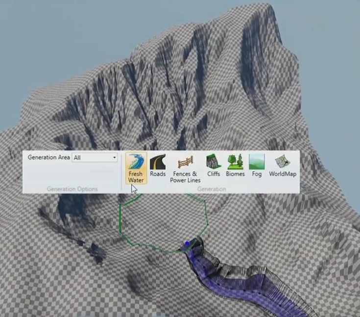
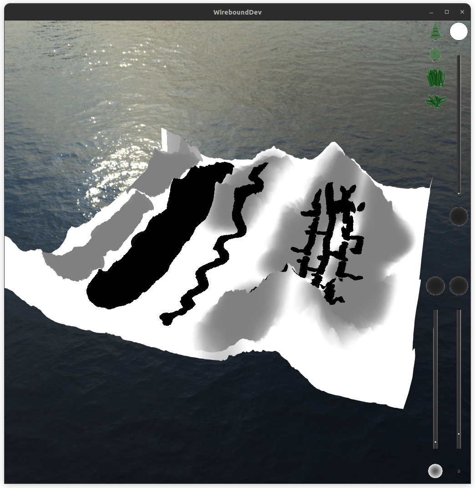
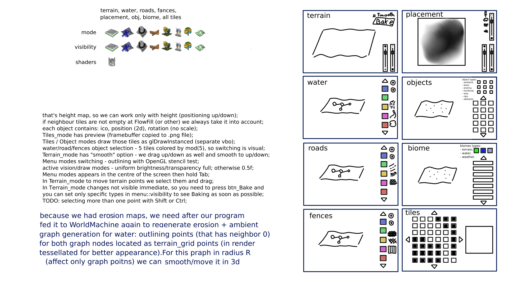

# WireboundWorldCreator
*Supplement for the main project [Wirebound](https://github.com/pol-31/Wirebound)*

**WireboundWorldCreator** useful for creating water and road maps,
modifying underlying terrain. This includes water flow, water & road
displacement maps and their topo maps (graph-like representation).

By design, we fly around the game world (by tiles) and modify terrain,
creating water roads. Because all Wirebound placement is procedural,
we can also see all such objects in real-time with set-up shaders.

Goal (borowed from [Water Rendering in Far Cry 5](https://www.youtube.com/watch?v=4oDtGnQNCx4&list=PPSV)):

Current (added "mini-paint" to draw placement maps):

Ui scratch:

Don't worry, I'll take it :]