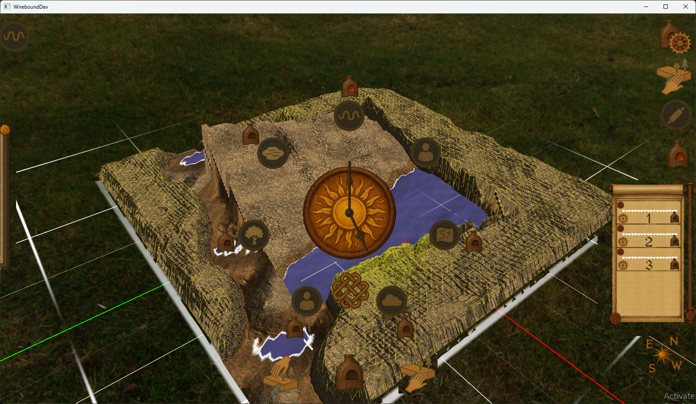

# WireboundWorldCreator game engine

- terrain generation
- Oceanographic spectra IFFT ocean
- river / roads in hmap / vector representation
- Tree - Bush - TallGrass - Undergrowth procedural generation pipeline
- pbr lightning, gltf model data
- custom ui implementation

Current progress:

